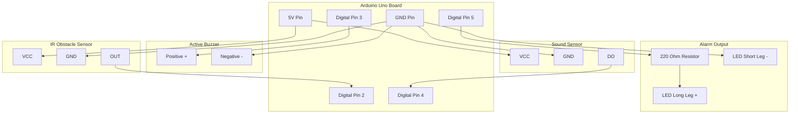

# Embedded C++ Closed-Loop Proximity Alarm & Audio Feedback System

A modular, high-performance embedded C++ application that establishes a synchronized hardware feedback loop using an Arduino Uno, an Infrared (IR) obstacle detection module, a piezo buzzer, an acoustic sound sensor, and an indicator LED.

The system uses conditional logic filters to eliminate environmental sound echoes, ensuring that the visual indicator LED triggers exclusively when the audio sensor registers the buzzer's specific output tone.

## 🛠 Hardware Architecture & Pin Mapping

All components share a common **5V** power rail and **GND** bus directly from the microcontroller. 

> ⚠️ **Safety Note:** Never power the sensor modules or actuators via the `VIN` pin or through uncalculated external resistors. This starves the onboard LM393 comparators and results in logic translation failures.


| Component | Physical Pin | Arduino Target Pin | Operational State Logic |
| :--- | :--- | :--- | :--- |
| **IR Obstacle Sensor** | OUT | **Digital Pin 2** | `LOW` = Obstacle Detected / `HIGH` = Clear |
| **Active Piezo Buzzer** | Positive (+) | **Digital Pin 3** | Driven by `tone()` frequency manipulation |
| **Acoustic Sound Sensor**| DO (Digital Out) | **Digital Pin 4** | `LOW` = Amplitude Threshold Breached |
| **Confirmation LED** | Long Leg (+) | **Digital Pin 5** | High-level output indicator |

---

## 📂 Project Structure

This project completely replaces standard monolithic Arduino `.ino` structures with clean, scalable, object-agnostic modular C++ headers and source files.

```text
my-arduino-feedback-system/
├── include/
│   └── Config.h             # Centralized hardware dashboard and global constants
├── src/
│   ├── FeedbackSystem.h     # Structural function blueprints and signatures
│   ├── FeedbackSystem.cpp   # Implementation logic for processing sensor nodes
│   └── main.cpp             # Global hardware orchestrator (setup / loop)
└── platformio.ini           # Compiler environmental controls and upload targets
```

---

## ⚙️ Compilation & Flashing Instructions

This project is built and maintained utilizing the **PlatformIO IDE** ecosystem inside **Visual Studio Code**, leveraging the standard `atmelavr` toolchain.

### Prerequisites
1. Install [Visual Studio Code](https://visualstudio.com).
2. Install the **PlatformIO IDE** extension from the VS Code Marketplace.
3. Clone this repository locally and open the root directory in VS Code.

### Compilation
To compile the C++ source files and verify structural syntax integrity, use the PlatformIO toolbar build button (\(\checkmark\)) or execute via the dedicated PlatformIO core terminal:
```bash
pio run
```

### Upload to Hardware
Connect your physical Arduino Uno to your PC via USB, clear any conflicting serial processes, and flash the compiled binary firmware:
```bash
pio run --target upload
```

### Serial Monitor Feed
To open a live serial data stream to capture operational metrics and check system updates directly in your command interface:
```bash
pio device monitor
```
*(To exit the active monitor feed, press `Ctrl + C` in your terminal interface).*

---

## 🔍 How the Code Operates

1. **Optical Scan:** The system constantly reads the state of `IR_SENSOR_PIN`. If an object enters the detection threshold, the pin falls `LOW`, triggering an automated 1000Hz alert tone via the buzzer.
2. **Acoustic Capture:** The sound module monitors ambient decibel spikes. To bypass environmental cross-talk or structural echo issues, a software conditional logic gate ensures the status LED shifts to an active `HIGH` state **only** if a sound is detected *while* the obstacle alert is running concurrently.
3. **Automated Cooldown:** The moment the target leaves the optical path, the buzzer is silenced and the LED is force-cleared to reset the system for the next event loop cycle.

---
## Circuit

